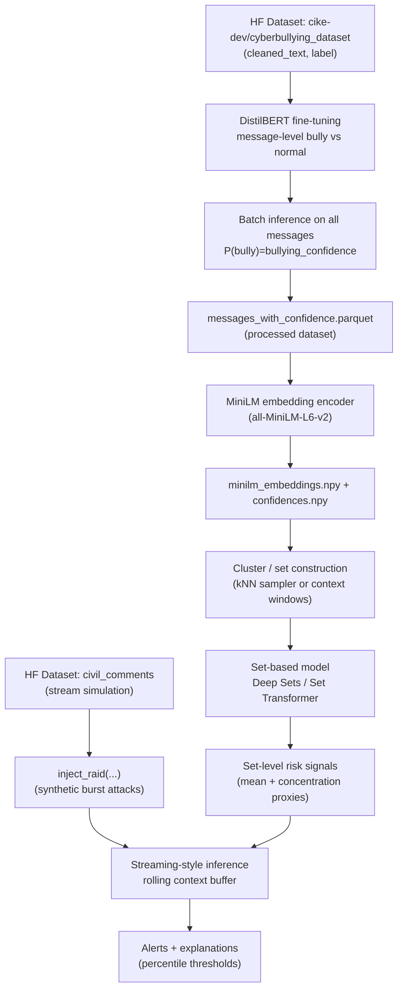
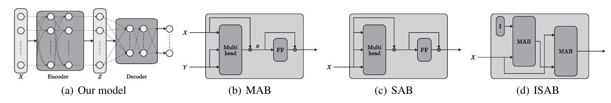
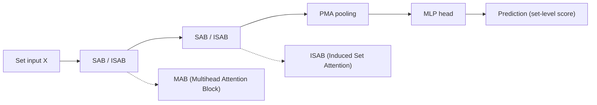
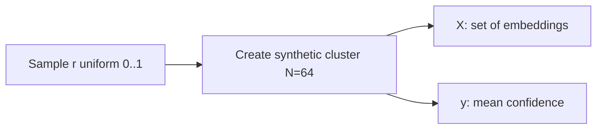
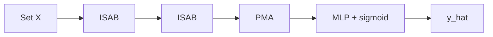
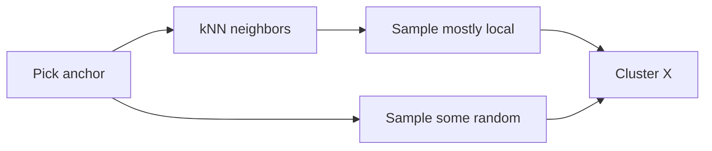
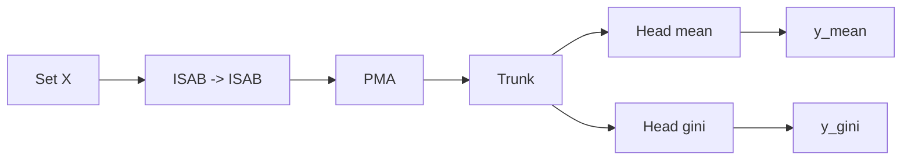
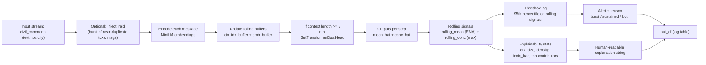
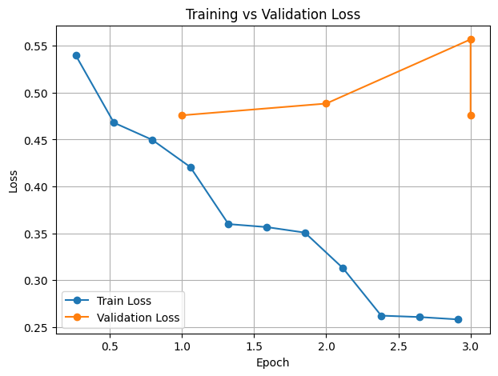
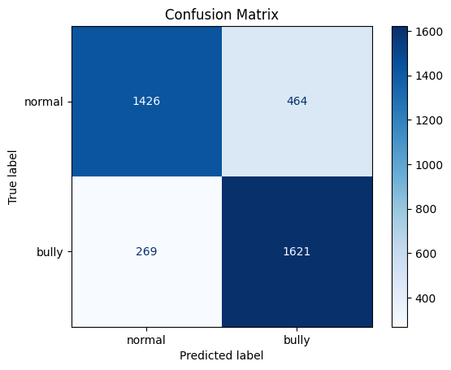

# Cyberbullying Detection (Project 3 — NLP)

## Project summary
This repository contains a Colab-first NLP pipeline for cyberbullying detection that targets **real-time, effective moderation at scale** (large networks / high-volume streams).

Instead of relying only on per-message classification, the project focuses on **context-/set-level risk estimation** over rolling windows ("crowd" behavior): detecting **dense and concentrated bullying** such as pile-ons and raids.

It uses two datasets for two different purposes:
- A **training dataset** (labeled cyberbullying messages) to train the message-level model and produce message-level confidence signals / embeddings:
  - Hugging Face: `cike-dev/cyberbullying_dataset`
- An **inference test dataset** to simulate a live stream and stress-test the alerting + explainability pipeline (including synthetic raid injection):
  - Hugging Face: `civil_comments`

It combines:
- A lightweight message representation layer (DistilBERT probabilities + MiniLM embeddings).
- Set-based models (Deep Sets / Set Transformer, including a dual-head variant) that score whole windows/clusters.
- A streaming inference + explainability + rule-based alerting layer (percentile thresholds over rolling signals).

**Success metric (cluster-level): Spearman rank correlation**
Model quality is measured primarily by whether it **orders sets correctly by severity**, quantified via **Spearman rank correlation** between the model score and a chosen proxy reference signal (e.g., mean toxicity vs concentration/Gini).

From `Cyberbullying_kNN.ipynb` (reported results):
- **Spearman(mean head)**: `ρ ≈ 0.7543`
- **Spearman(concentration / top-k head)**: `ρ ≈ 0.7217`

Core references:
- Deep Sets: https://arxiv.org/pdf/1703.06114
- Set Transformer: https://arxiv.org/pdf/1810.00825

## Background / problem statement
Social platforms often need to detect **group-level / crowded cyberbullying**: situations where many messages pile onto a target, often sharing similar semantics (e.g., repeated insults, coordinated harassment, raids).

Why this is hard in practice:
- **Per-message inference is expensive at scale**: running a transformer classifier on every single message in real time can be too slow/costly for large streams.
- **LLM-based moderation is typically even slower and more expensive**, and can be hard to operationalize under strict latency budgets.
- **Basic RAG is limited to similarity retrieval**: it can fetch “similar past messages”, but it does not directly output a reliable *risk score* for a *set* (crowd) of messages, nor does it explicitly capture *density* and *concentration* of harm.

What this project aims to do instead:
- Build a **fast inference system** that detects **dense and concentrated bullying**, where messages are **semantically similar** and collectively indicate escalation.
- Convert message-level signals into **set-level signals** (mean harm + concentration/burstiness), enabling real-time “situation awareness” over a rolling context.

The project builds:
- A **message-level binary classifier** (DistilBERT) for `bully` vs `normal`.
- A **confidence-augmented dataset** where each message is assigned a bullying probability.
- **Semantic embeddings** (MiniLM) for downstream clustering / retrieval.
- **set-based models** (Deep Sets, Set Transformer) that score *clusters / windows* of messages (i.e., “how risky is this conversation slice?”), emphasizing **density and concentration** rather than only single-message classification.

## Team members
- Tomer Sagi.

## Repository contents (what to run)
This repo is notebook-based:
- `Cyberbullying_DistilBERT.ipynb`
  - Fine-tunes DistilBERT on the dataset and saves a model.
  - Produces a processed parquet with `bullying_confidence`.
- `Cyberbullying_MiniLM_Embeddings.ipynb`
  - Encodes all messages with MiniLM, saves embeddings, and creates “strong bully / strong safe / ambiguous” masks.
- `Cyberbullying_Cluster_Level_Bullying_Detection_(Set_Based_Model).ipynb`
  - Deep Sets baseline for **cluster-level bullying intensity**.
- `Cyberbullying_Set_Transformer.ipynb`
  - Set Transformer regressor for **cluster-level bullying intensity**.
- `Cyberbullying_kNN.ipynb`
  - kNN-based cluster sampling and a dual-head Set Transformer variant.
- `Cyberbullying_Inference_NO_TIME_AWARE.ipynb`
  - Streaming-style inference over a rolling context buffer (context set), producing alerts and qualitative explanations.

> Important: The notebooks assume Google Drive paths such as `/content/drive/MyDrive/grunitech-project3-cyberbullying` for artifacts.

---

## Dataset
### Source
- Hugging Face Datasets: `cike-dev/cyberbullying_dataset`

### Candidate datasets considered (and why this one was chosen)

| Category | Dataset | What it contains | Why considered | Why chosen / not chosen |
|---|---|---|---|---|
| Cyberbullying-specific | `cike-dev/cyberbullying_dataset` | ~30k balanced texts labeled `bully` vs `normal`; combined from several public hate/offensive corpora (Twitter, Gab, Stormfront, etc.). | Strong starting point for a clean **binary** bullying classifier; enough scale for fine-tuning. | **Chosen**: binary labels match Project 3’s message-level classifier; balanced classes simplify initial training + evaluation. |
| Cyberbullying-specific | `AnikaBasu/CyberbullyingDataset` | Tweets labeled with cyberbullying categories plus non-bullying. | Useful for **multi-class** bullying types (religion/appearance/intelligence/etc.). | Not chosen for the core baseline here because Project 3 starts with a binary classifier (bully vs normal); can be used later for fine-grained targets. |
| Cyberbullying-specific | `poleval/poleval2019_cyberbullying` | Harmful vs non-harmful tweets; includes cyberbullying and hate. | Useful to stress-test generalization and multilingual behavior. | Not chosen for the baseline because it introduces language/domain differences; better used as an out-of-domain evaluation set later. |
| Cyberbullying-specific | `faisalahmed/Bengali_Cyberbullying_Detection_Comments_Dataset` | Bengali comments labeled for bullying vs non-bullying (+ severity in some versions). | Good candidate for cross-lingual generalization experiments. | Not chosen for the baseline (language mismatch); suitable for future cross-lingual experiments. |

### Fields
- `cleaned_text`: normalized message text.
- `label`: `bully` / `normal`.

### Splits and balance (as used in notebooks)
From the notebook exploration:
- **Train**: 30,240 rows
- **Validation**: 3,780 rows
- **Test**: 3,780 rows
- **Class balance (train)**: 50% `bully`, 50% `normal`

Example rows and label distribution output (from `Cyberbullying_DistilBERT.ipynb`):

```text
                                        cleaned_text   label  \
0               im so mad cause hoes think its funny   bully   
1         that night cap nonsense is for the birds.!  normal   
2  robertpoeti wants an explanation why the audit...  normal   
3  chris hall cbc the liberals fall strategy just...  normal   
4  user thank you finally a white person stating ...  normal   

   __index_level_0__  
0               3227  
1               5074  
2              10776  
3              11592  
4              34126  
Counts:
label
bully     15120
normal    15120
Name: count, dtype: int64

Percentages:
label
bully     50.0
normal    50.0
Name: proportion, dtype: float64
```

### Notes / risks
Why this dataset works well for this project:
- It supports a strong, clean **binary** message-level baseline.
- It is large enough to fine-tune a transformer and produce stable metrics.
- The balanced labels make early experiments and thresholding easier to interpret.

Known limitations / risks:
- The dataset is perfectly balanced, which is convenient for training and reporting metrics but may not reflect real-world prevalence.
- Labels are binary; they do not separate harassment types (threats, identity attacks, profanity-only, sarcasm, etc.).
- Domain mismatch is likely (training data sources are social platforms, but later inference simulation uses `civil_comments`), which can affect calibration and false-positive/false-negative tradeoffs.

### Inference simulation dataset (2nd dataset)
The inference notebook also uses a second dataset to simulate *live* social-media streams:
- Hugging Face Datasets: `civil_comments`

How it is used in `Cyberbullying_Inference_NO_TIME_AWARE.ipynb`:
- A small slice is loaded (e.g., `train[:5000]`).
- The notebook uses:
  - `text` as message content.
  - `toxicity` as a **proxy ground-truth** signal to evaluate alert behavior.
- Synthetic `conv_id` values and arrival timestamps (`ts`) are generated to emulate multiple concurrent threads.

This dataset is **not** used to train the cyberbullying classifier; it is used to stress-test the *group-level detection / alerting loop* under realistic stream conditions.

---

## Architecture

End-to-end pipeline (as implemented across the notebooks):



 Set Transformer reference (attention-based permutation-invariant modeling):
 - Lee et al., **Set Transformer: A Framework for Attention-based Permutation-Invariant Neural Networks** (arXiv:1810.00825)
   - https://arxiv.org/pdf/1810.00825
 
 **Set Transformer architecture (paper reference)**
 
 If you want to include the paper figure directly in this repo, save it as:
 - `assets/set_transformer_paper_architecture.png`
 
 Then it will render here:
 
 
 
 A simplified visual of the same idea (how the blocks relate):
 


---

## Models & methods

### Model selection (quick comparison)
 
 | Model | Size | Speed | Accuracy |
 |---|---|---|---|
 | BERT-base | 110M params | slower | highest |
 | DistilBERT | 66M params | ~60% faster | ~97% accuracy of BERT |
 | MiniLM | 33M | much faster | good |
 | RoBERTa | 125M | slower | strong accuracy |
 
 ### 1) Message-level classifier: DistilBERT
 Notebook: `Cyberbullying_DistilBERT.ipynb`
 
 - Model: `distilbert-base-uncased` with a 2-class classification head.
 
 Why DistilBERT (for training the bullying classifier):
 - It provides strong transformer accuracy while being significantly lighter than BERT-base, which fits the project’s emphasis on **fast inference**.
 - It is a widely supported Hugging Face baseline (stable training + deployment), and works well as a first-stage message-level scorer.
 - Training:
   - `num_train_epochs=3`
   - `learning_rate=2e-5`
   - `per_device_train_batch_size=16`
   - `weight_decay=0.01`
 - Metrics: accuracy + F1.

**Confidence augmentation**
After training, the notebook runs batched inference and computes:
- `bullying_confidence = P(label=bully)`

It then exports a parquet:
- `messages_with_confidence.parquet` (saved to Google Drive under `data/processed/`)

 ### 2) Embeddings: MiniLM
 Notebook: `Cyberbullying_MiniLM_Embeddings.ipynb`
 
 - Encoder: `sentence-transformers/all-MiniLM-L6-v2`
 
 Why MiniLM (for embeddings + similarity / clustering):
 - It is optimized for **sentence embeddings** (via Sentence-Transformers), giving good semantic similarity quality at low latency.
 - It is smaller/faster than BERT/RoBERTa, which matters when embedding **tens of thousands** of messages and when building real-time similarity-based grouping.
 - Output:
   - `minilm_embeddings.npy` with shape `(34020, 384)`
   - `labels.npy`
   - `confidences.npy`

The notebook also defines confidence-based masks:
- **Strong bully**: `bullying_confidence > 0.9` (10,619 samples)
- **Strong safe**: `bullying_confidence < 0.1` (5,669 samples)
- **Ambiguous**: the rest (17,732 samples)

### 3) Cluster-level / set-based modeling
Goal: Given a *set* of message embeddings (a cluster or a context window), output a continuous risk score.

#### 3.1 Deep Sets baseline
Notebook: `Cyberbullying_Cluster_Level_Bullying_Detection_(Set_Based_Model).ipynb`

- Architecture: `phi(·)` per element + mean pooling + `rho(·)`.
- Target label: `mean(bullying_confidence)` within the sampled set.

 Reference: Zaheer et al., **Deep Sets** (arXiv:1703.06114) — https://arxiv.org/pdf/1703.06114

This notebook is the first cluster-level **sanity check** step.
It constructs synthetic clusters by explicitly controlling the bully-vs-safe composition, then trains a Deep Sets model to predict a smooth cluster “bullying intensity” score.

**Cluster progression (synthetic clusters)**
- Sample a ratio `r` uniformly between 0 and 1.
- For a fixed cluster size (e.g., `N=64`):
  - `n_bully = int(N * r)` samples are drawn (with replacement) from `strong_bully`.
  - The remaining samples are drawn from a “safe pool” (in the notebook: `strong_safe` plus `ambiguous`).
- Shuffle the set to enforce permutation invariance.
- Define a continuous target:
  - `y = mean(bullying_confidence)` over the sampled set.



**How it is evaluated (as a test)**
- The notebook checks that the model learns a sensible mapping by plotting:
  - label histogram vs prediction histogram,
  - calibration scatter (`y` vs `y_hat`),
  - residual distribution,
  - and a monotonicity sweep where increasing `r` should increase the predicted score.


#### 3.2 Set Transformer
Notebook: `Cyberbullying_Set_Transformer.ipynb`

- Architecture: ISAB → ISAB → PMA pooling → MLP head.
- Target label: `mean(bullying_confidence)` within the sampled set.

This notebook repeats the same cluster-level regression idea, but replaces Deep Sets with an attention-based Set Transformer.

**Training setup (synthetic clusters with ambiguity injection)**
- Each set is built from:
  - a “core” whose bully/safe composition is controlled by `r` uniform 0..1, and
  - an `ambig_fraction` drawn from the ambiguous pool to simulate harder, noisier clusters.
- The target stays continuous:
  - `y = mean(bullying_confidence)`.



Reference: Lee et al., **Set Transformer: A Framework for Attention-based Permutation-Invariant Neural Networks** (arXiv:1810.00825) — https://arxiv.org/pdf/1810.00825

**Deep Sets vs Set Transformer (high-level comparison)**

| Feature | DeepSets | Set Transformer |
|---|---:|---:|
| Models pairwise relations | ❌ | ✅ |
| Captures complex patterns | 🟡 | 🟢🟢 |
| Speed & memory | 🟢🟢 | 🔴 |
| Data efficiency | 🟢 | 🟡 |
| Training simplicity | 🟢🟢 | 🟡 |
| Best for small sets | 🟡 | 🟢 |
| Best for large sets | 🟢🟢 | 🔴 |
| Overfitting risk | 🟢 Low | 🔴 Higher |

#### 3.3 kNN cluster sampler + dual-head set model
Notebook: `Cyberbullying_kNN.ipynb`

- Uses a kNN index over embedding space to construct “mostly-local + some-random” clusters.
- Trains a dual-head Set Transformer:
  - **Mean head**: overall intensity (`mean(confidence)`).
  - **Top-k / concentration head**: concentration-style target (implemented as Gini in later iterations).

This notebook moves from synthetic composition to clusters that are **local in embedding space**.

**Embedding-space clustering (kNN neighborhood sets)**
- Build a cosine kNN index over the MiniLM embedding space.
- For each cluster:
  - choose a random anchor message,
  - retrieve its neighbors,
  - sample most of the set from neighbors and inject some random messages using `mix_ratio`.



**Why dual-head**
- `y_mean` captures overall harm level (average confidence).
- A second signal captures within-cluster structure; later iterations use **Gini** on confidences as a concentration proxy.

**Target (label) roadmap in the notebook**
The `KNNClusterDataset` section iterates through several label definitions while searching for a second signal that captures *crowd concentration* (not just volume):
- **1) Mean only (single target)**
  - `y = mean(confidence)`
  - Good baseline for overall intensity, but misses “spiky” clusters.
- **2) Top-k magnitude (single target)**
  - `y = mean(top_k(confidence))`
  - Emphasizes the most toxic messages, but is still mostly a magnitude signal.
- **3) Two targets: mean + top-k magnitude**
  - `y_mean = mean(confidence)`
  - `y_topk = mean(top_k(confidence))`
  - Enables the model to separate “overall harm” from “peak harm”.
- **4) Two targets: mean + contrast (top-k minus mean)**
  - `y_topk = clip(mean(top_k(confidence)) - y_mean, 0, 1)`
  - Shifts the second head toward “how concentrated is the harm above baseline”.
- **5) Two targets: mean + concentration (Gini)**
  - `y_topk = gini(confidence)`
  - Interprets the second head as **concentration / inequality** of toxicity within the set (structure, not magnitude).

**Loss roadmap in the notebook**
The training loop also iterates over losses to avoid two failure modes:
1) learning the mean but ignoring concentration, and
2) producing collapsed / near-constant predictions.

- **1) BCE (initial idea)**
  - Considered early on, but the targets are continuous regression values rather than binary labels.
- **2) Weighted SmoothL1 (regression baseline)**
  - `SmoothL1Loss` with per-head weights (e.g., higher weight for concentration).
  - Stable, but can still under-penalize collapsed predictions.
- **3) MSE (penalize flat predictions harder)**
  - `MSELoss` to increase penalty for deviations and encourage spread.
- **5) Quantile loss (pinball)**
  - Use different quantiles for different heads (e.g., `q_mean=0.5`, `q_topk=0.8`) to focus on the **high-risk tail** for concentration.
- **6) Hybrid loss: quantile + ranking (ordering)**
  - Combine:
    - quantile loss (gets the scale right), and
    - ranking loss (enforces monotonic ordering inside a batch).
  - This aligns with the evaluation focus on Spearman rank correlation.

**Evaluation notes**
- The notebook reports good Spearman rank correlation for ordering, but also detects a critical failure mode: prediction collapse (near-constant outputs with extremely small standard deviation), which matters for calibration in high-risk regions.

#### Evaluation (ranking-based)

**What it measures**
At cluster-level, the main question is:

**Does your model order sets correctly relative to a proxy “severity signal”?**

This is the core evaluation criterion because most downstream actions (e.g., alerts) are **percentile/rank based** rather than relying on perfect calibration.

**Spearman rank correlation (core metric)**

For each set (cluster/context window) `S_i`:
- **Model output**:
  - `ŷ_i = model_score(S_i)`
- **Reference signal** (choose one proxy):
  - `y_ref,i = mean(P(bully))`
  - `y_ref,i = rolling_conc(S_i)` (defined below)
  - `y_ref,i = gini(P(bully))` (defined below)

Then compute:

`ρ = Spearman(ŷ, y_ref)`

**Why Spearman (not Pearson)**
- **Invariant to scale**: if your model learns a monotonic transform of the severity signal, Spearman remains high.
- **Measures ordering, not calibration**: aligns with “top percentile = alert” workflows.
- **Robust to non-linear scoring**: your severity proxy may not be linearly related to the model score.
- **Matches the use-case**: detection is thresholded by quantiles/percentiles rather than a fixed absolute score.

**Benchmark targets (rule of thumb)**

| ρ value | Interpretation |
|---:|---|
| < 0.3 | Not learning the signal |
| 0.3–0.6 | Weak but usable |
| 0.6–0.8 | Good |
| > 0.8 | Strong / near-oracle ordering |

#### Proxy severity signals

The reference signal should capture “how bad is this set?” even when the mean toxicity alone is ambiguous.

**A) `rolling_conc` (recommended)**

Let `p_1..p_N` be message-level scores inside a window (e.g., `p_i = P(bully)_i` from a message-level classifier).
Let `τ` be a toxicity threshold and define the “toxic count”:

`T = |{ p_i > τ }|`

Define:

`rolling_conc(S) = (T / N) × Gini({p_i})`

**Interpretation**
High when:
- there are **many toxic messages** (high `T/N`), and
- toxicity is **unevenly concentrated** (high Gini), which matches “raid-like” patterns.

This combines **density + structure**, and tends to correlate well with the human intuition of “this feels like coordinated harassment”.

**B) Gini coefficient (core insight)**

For sorted scores `p_(1) ≤ ... ≤ p_(n)`:

`Gini = ( Σ_{i=1..n} (2i - n - 1)·p_(i) ) / ( n · Σ_{i=1..n} p_(i) )`

**Meaning**

| Gini | Interpretation |
|---:|---|
| ≈ 0 | Uniform toxicity across the set |
| High | A few messages dominate (spiky/raid-like) |

**Why it helps with collapse**
If the mean toxicity is relatively flat across many sets, a second target like Gini injects **shape information** (inequality / concentration) that discourages the model from outputting a near-constant score for all sets.



### 4) Inference (streaming-style, no time-awareness)
Notebook: `Cyberbullying_Inference_NO_TIME_AWARE.ipynb`

- Maintains a rolling buffer (a *context set*) of the last `CTX_MAXLEN` messages.
- Runs the set model on the buffer.
- Computes explainability stats (context size, density, toxic fraction, top contributors).
- Produces alerts using percentile thresholds over rolling signals.

**Inference flow (as implemented in the notebook)**



**Example output table (`out_df.head(3)` in the notebook)**

| msg_id | ts | conv_id | toxicity | mean_hat | conc_hat | rolling_mean | rolling_conc | ctx_size | ctx_time_span | ctx_density | ctx_toxic_frac | explanation |
|---:|---:|---:|---:|---:|---:|---:|---:|---:|---:|---:|---:|---|
| 4 | 8.1123 | 106 | 0.8936 | 0.5868 | 0.3961 | 0.0587 | 0.3961 | 5 | 7.2259 | 0.6920 | 0.2000 | `ctx=5 msgs / 7.2s | density=0.69 msg/s | 20% toxic | meanT=0.18 peakT=0.89` |
| 5 | 9.3214 | 71 | 0.6667 | 0.5869 | 0.3961 | 0.1115 | 0.3961 | 6 | 8.4350 | 0.7113 | 0.3333 | `ctx=6 msgs / 8.4s | density=0.71 msg/s | 33% toxic | meanT=0.26 peakT=0.89` |
| 6 | 9.7627 | 188 | 0.4576 | 0.5869 | 0.3961 | 0.1590 | 0.3961 | 7 | 8.8763 | 0.7886 | 0.2857 | `ctx=7 msgs / 8.9s | density=0.79 msg/s | 29% toxic | meanT=0.29 peakT=0.89` |

**What the columns mean (brief)**
- **`mean_hat`, `conc_hat`**: dual-head set model predictions for the current context.
- **`rolling_mean`**: exponential moving average over `mean_hat` (smooth “tension” signal).
- **`rolling_conc`**: rolling maximum over `conc_hat` (captures bursty/concentrated events).
- **`ctx_*` columns**: explainability computed from the current context window (size, time span, density, toxicity summary).
- **`explanation`**: compact human-readable summary of the current context.

**Alerts table (as printed in the notebook)**
The notebook defines thresholds as the 95th percentile of `rolling_mean` and `rolling_conc`, then flags:
- **burst**: `rolling_conc > CONC_TH`
- **sustained**: `rolling_mean > MEAN_TH`
- **both**: both conditions

**Alert system rules (exact notebook logic)**
The alerting stage is fully rule-based over the rolling signals:

```text
MEAN_TH = quantile(rolling_mean, 0.95)
CONC_TH = quantile(rolling_conc, 0.95)

cond_sustained = rolling_mean > MEAN_TH
cond_burst     = rolling_conc > CONC_TH

alert = cond_sustained OR cond_burst
alert_reason ∈ {"sustained", "burst", "both"}
```

**Sample from the alerts table**
This matches the dataframe slice printed in the notebook:

| msg_id | ts | conv_id | toxicity | rolling_mean | rolling_conc | alert_reason | explanation |
|---:|---:|---:|---:|---:|---:|---|---|
| 4 | 8.1123 | 106 | 0.8936 | 0.0587 | 0.3961 | burst | `ctx=5 msgs / 7.2s | density=0.69 msg/s | 20% toxic | meanT=0.18 peakT=0.89` |
| 5 | 9.3214 | 71 | 0.6667 | 0.1115 | 0.3961 | burst | `ctx=6 msgs / 8.4s | density=0.71 msg/s | 33% toxic | meanT=0.26 peakT=0.89` |
| 6 | 9.7627 | 188 | 0.4576 | 0.1590 | 0.3961 | burst | `ctx=7 msgs / 8.9s | density=0.79 msg/s | 29% toxic | meanT=0.29 peakT=0.89` |

**Meaning of each alert-table column**
- **`msg_id`**: stable sequential id assigned to each message in the simulated stream.
- **`ts`**: simulated arrival time (seconds) used to compute context time span + density.
- **`conv_id`**: simulated thread/conversation id (the injected raid uses a dedicated id like `999`).
- **`toxicity`**: dataset-provided ground-truth toxicity score (used here for evaluation and explainability summaries).
- **`rolling_mean`**: smoothed risk estimate (EMA over `mean_hat`).
- **`rolling_conc`**: burst score (rolling max over `conc_hat`).
- **`alert_reason`**:
  - `burst` if `rolling_conc > CONC_TH`
  - `sustained` if `rolling_mean > MEAN_TH`
  - `both` if both conditions hold.
- **`explanation`**: human-readable summary derived from the current context window (size, span, density, % toxic, mean/peak toxicity).

**Alert source detection (`show_alert_context`)**
To help debug *why* an alert fired, the notebook defines a helper that:
- Prints the alert row’s key fields (`msg_id`, rolling signals, `alert_reason`).
- Prints `explanation`.
- Extracts the **top context contributors**: messages in the current context window sorted by `toxicity` (descending) and shown as `(msg_id, toxicity, snippet)`.

**Sample: top contributors for the first alert**

| msg_id | toxicity | snippet |
|---:|---:|---|
| 4 | 0.89 | `haha you guys are a bunch of losers.` |
| 3 | 0.00 | `Is this something I'll be able to install on my site? When will you be releasing it?` |
| 2 | 0.00 | `This is such an urgent design problem; kudos to you for taking it on. Very impressive!` |
| 1 | 0.00 | `Thank you!! This would make my life a lot less anxiety-inducing. Keep it up, and don't let anyone get in your way!` |
| 0 | 0.00 | `This is so cool. It's like, 'would you want your mother to read this??' Really great idea, well done!` |

**Meaning of each contributor-table column**
- **`msg_id`**: message id inside the current context window.
- **`toxicity`**: ground-truth toxicity for that message (used as a proxy for “contributor” ranking).
- **`snippet`**: first ~120 characters of the message (for quick inspection).

**Simulating raids (`inject_raid`)**
To evaluate detection of crowded/bursty harassment, the notebook defines an `inject_raid(...)` function that:
- Selects a high-toxicity message template from `civil_comments` (by `toxicity` threshold).
- Inserts a burst of near-duplicate toxic messages into the stream (controlled by `raid_start_idx`, `raid_size`, and inter-message spacing `dt`).
- Assigns the injected burst to a dedicated `conv_id` (e.g., `999`) to emulate a coordinated “raid”.

This helps validate whether the system detects **dense and semantically consistent bullying** without relying on expensive per-message LLM reasoning.


---

## Results

### DistilBERT (message-level)
From `Cyberbullying_DistilBERT.ipynb`:
- `eval_accuracy`: **0.7886**
- `eval_f1`: **0.7972**

Classification report shown in the notebook (validation):
- **Accuracy**: **0.8061**
- `normal` F1: **0.7955**
- `bully` F1: **0.8156**

Artifacts/plots generated in-notebook:
- Label distribution
- Train vs validation loss curve
- Confusion matrix

**Comparison table (epoch-level training summary)**

| Epoch | Training Loss | Validation Loss | Accuracy | F1 |
|---:|---:|---:|---:|---:|
| 1 | 0.4498 | 0.4759 | 0.7886 | 0.7972 |
| 2 | 0.3507 | 0.4884 | 0.7981 | 0.7997 |
| 3 | 0.2581 | 0.5569 | 0.7950 | 0.7976 |

**Training vs validation loss**



**Confusion matrix**



### MiniLM embedding space sanity checks
From `Cyberbullying_MiniLM_Embeddings.ipynb`:
- A simple 2-means clustering produced a **low silhouette score (~0.032)**, indicating that bully vs normal is not cleanly separable in embedding space with this simplistic clustering setup.
- UMAP visualization is generated and colored by `bullying_confidence`.

### Cluster-level models
From the cluster/set notebooks:
- Deep Sets and Set Transformer both produce monotonic responses to synthetic cluster composition.
- The kNN + dual-head experiment reports relatively good rank correlation (Spearman) but also shows **prediction collapse** (near-constant outputs), suggesting a mismatch between target definition, loss, or model capacity/regularization.

---

## Qualitative examples

### Message-level confidence example
From `Cyberbullying_DistilBERT.ipynb`:
- Input: `you are such an idiot`
  - Prediction: `bully` with bullying confidence ≈ **0.945**
- Input: `nice photo!`
  - Prediction: `normal` with bullying confidence ≈ **0.046**

### Context-level “alert” explanation
From `Cyberbullying_Inference_NO_TIME_AWARE.ipynb`, the monitoring loop emits explanations like:
- `ctx=5 msgs / 7.2s | density=0.69 msg/s | 20% toxic | meanT=0.18 peakT=0.89`

It also prints the top context contributors (message id, toxicity, snippet) to help debug *why* an alert fired.

---

## Setup instructions

### Recommended: run in Google Colab (as authored)
These notebooks are written for Colab and Google Drive.

- **Hugging Face token**: the DistilBERT notebook uses `huggingface_hub.login(token=...)`.
  - Set a Colab secret named `HF_TOKEN`.
- **Weights & Biases** (optional): training logs use `wandb`.
  - Set a Colab secret such as `w&b_api_key` (as referenced in the notebook).

Typical installs used across notebooks:
- `transformers==4.57.3`
- `datasets`
- `evaluate`
- `sentence-transformers`
- `scikit-learn`
- `umap-learn`
- `plotly`
- `pandas`
- `matplotlib`
- `torch`

### Local run (optional)
This repo does not currently include a `requirements.txt`.
If you want to run locally, create a virtualenv and install dependencies similar to the Colab cells:
- `pip install transformers==4.57.3 datasets evaluate sentence-transformers scikit-learn umap-learn plotly pandas matplotlib torch tqdm`

---

## Analysis

### Empirical findings (what we learned)
- DistilBERT achieves **~0.79–0.81 accuracy** and **~0.80 F1**, showing the dataset supports a reasonably strong binary classifier.
- Embedding-space clustering with a simple KMeans(2) baseline is weak (silhouette ≈ 0.03), suggesting:
  - bully vs normal is not a single linear/separable semantic axis, and/or
  - the “bully” concept is multi-modal.
- Set-based modeling is promising for conversation monitoring, but target design matters (mean vs concentration vs top-k).

### Overfitting / underfitting / collapse
- **DistilBERT**
  - Train loss (~0.36) vs eval loss (~0.48) indicates a modest generalization gap (mild overfitting).
- **kNN + dual-head Set Transformer**
  - The notebook shows **very low prediction variance** (near constant min/max, std ≈ 1e-6), which is a strong sign of underfitting or a degenerate solution.
  - The notebook text itself notes saturation in the “high-risk region”.

### Limitations and failure cases
- **Ambiguity / pragmatics**: sarcasm, irony, playful insults between friends.
- **Domain shift**: platform slang changes rapidly; training data may become stale.
- **Binary labeling**: does not capture severity and type of harm.
- **Cluster construction**: synthetic clusters may not match real conversational dynamics.
- **Context missing**: the base dataset is message-level; conversation-level meaning often needs thread context.

### Suggested improvements
- **Longer / structured context**
  - Include true conversation threads and temporal windows.
  - Add explicit time features and per-user identity features (when permitted).
- **Better retrieval / clustering**
  - Replace KMeans with density-based methods, or use supervised contrastive training.
  - Build a vector DB index and evaluate retrieval quality.
- **Training improvements**
  - Add calibration (temperature scaling), class-conditional thresholds, and uncertainty.
  - Consider LoRA adapters for fast iteration.
- **Evaluation improvements**
  - Report per-slice metrics: short vs long messages, profanity-only, identity mentions.
  - Stress-test with adversarial paraphrases.

---

## Future work
- **Per-thread aggregations**
  - Replace the “rolling last-N messages” context with thread-aware features (per-thread mean risk, per-thread concentration, unique attackers, reply graph statistics).
  - This should reduce false positives caused by mixing unrelated conversations into the same context buffer.
- **Conversation-level RL**
  - Train an RL policy that chooses actions (alert / rate-limit / require verification / escalate to human) using conversation state features.
  - Reward shaping can penalize missed escalation (false negatives) and noisy moderation (false positives).
- **Time window modeling**
  - Incorporate real timestamps and learn risk over explicit windows (e.g., 30s / 5m / 1h), enabling true *density* estimates (messages per time).
  - Evaluate raid-like patterns: sudden bursts vs sustained harassment.
- **Target classification**
  - Extend from “is this bullying?” to “who/what is being targeted?” (user, group, protected class, creator/channel), and predict severity/type.
  - This enables downstream actions that depend on target type and policy.

---

## Reproducibility checklist
- Run notebooks in this order:
  1. `Cyberbullying_DistilBERT.ipynb`
  2. `Cyberbullying_MiniLM_Embeddings.ipynb`
  3. `Cyberbullying_Cluster_Level_Bullying_Detection_(Set_Based_Model).ipynb`
  4. `Cyberbullying_Set_Transformer.ipynb`
  5. `Cyberbullying_kNN.ipynb`
  6. `Cyberbullying_Inference_NO_TIME_AWARE.ipynb`

- Verify your `BASE_DIR` points to a writable Drive folder.

